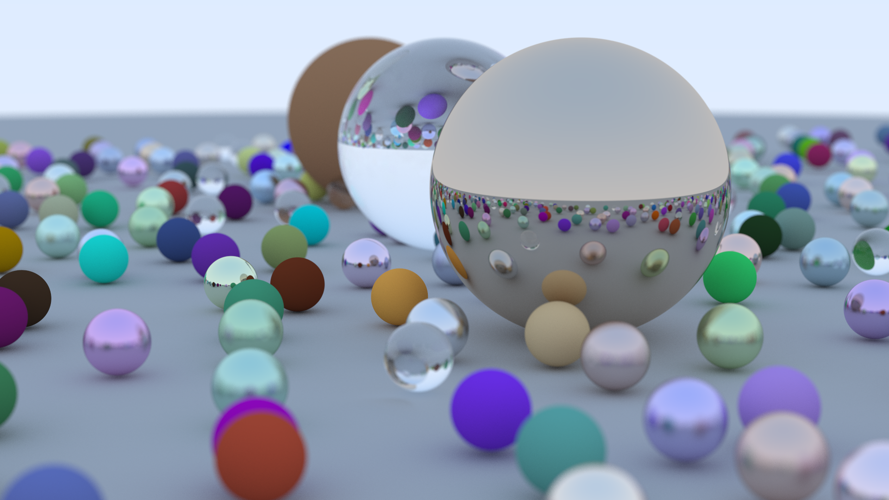

# Ray Tracing in One Weekend

## About

This repo is simply my attempt at following the [_Ray Tracing in One Weekend_](https://raytracing.github.io/books/RayTracingInOneWeekend.html) book.

The code is almost a 1:1 copy of the book, with some simple differences like different variable names. It is not optimized in any way.

The output images are in the PPM file format.



:snail: _This 1920x1080 with 500 samples image took 2 hours 38 minutes to render single threaded on an i3-4170 CPU_ :snail:
## Building

To build run:
```
git clone https://github.com/Igor-Teixeira/RayTracing-IOW.git
cd RayTracing-IOW
cmake -S . -B build
cmake --build build -j4 --config Release
```

Running:
```
./raytracer [width (px)] [height (px)] [samples] [output file]
```
